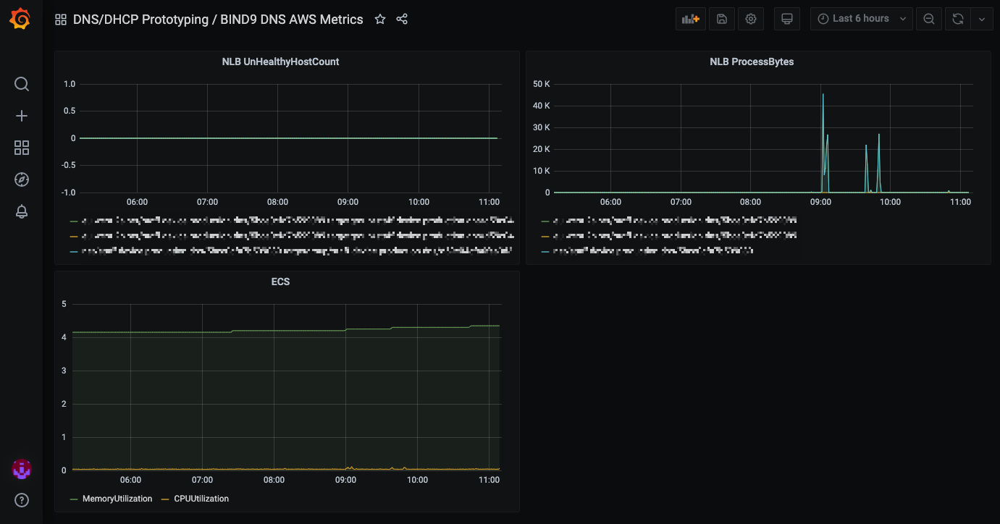

# DNS Docker Image

This folder contains the dockerfile to create the [BIND](https://www.isc.org/bind/) DNS server docker image.

This images is pushed up to [Amazon ECR](https://aws.amazon.com/ecr/).

## Getting started

To get started with development you will need:

- [Docker](https://www.docker.com/)
- [Docker Compose](https://docs.docker.com/compose/)

### Authenticating Docker with AWS ECR

The Docker base image is stored in ECR. Before you can build the app you need to authenticate Docker to the ECR registry. [Details can be found here](https://docs.aws.amazon.com/AmazonECR/latest/userguide/Registries.html#registry_auth).

If you have aws-vault set up with credentials for shared services, you can do the following to authenticates:

```bash
aws-vault exec SHARED_SERVICES_VAULT_PROFILE_NAME -- aws ecr get-login-password --region eu-west-2 | docker login --username AWS --password-stdin SHARED_SERVICES_ACCOUNT_ID.dkr.ecr.eu-west-2.amazonaws.com
```

### Running locally

See the target `run` in the [Makefile](./Makefile)

### Deploying to production

Deployments are automated in the CI pipeline. See [buildspec.yml](./buildspec.yml)

## Automated Testing

To run the tests locally run

```bash
$ make test
```

## Statistics

[Enabling Statistics](https://bind9.readthedocs.io/en/latest/reference.html#the-statistics-file)

[API format](https://bind9.readthedocs.io/en/latest/reference.html#statschannels)

server and resolver `curl localhost:8080/json/v1/server` [example](./stats/server_stats.json)
zones `curl localhost:8080/json/v1/zones` [example](./stats/zones.json)
traffic `curl localhost:8080/json/v1/traffic`[example](./stats/traffic.json)
network status and socket `curl localhost:8080/json/v1/net` [example](./stats/net.json)

## Monitoring

Metrics are displayed in the [IMA Grafana dashboard](https://github.com/ministryofjustice/staff-infrastructure-monitoring).
The JSON that makes up the dashboard is stored in this repo, when updates are made, the JSON needs to be saved and tracked with version control.

The metrics categories are:

- AWS Service metrics
- DNS metrics



# Performance Testing

 Results of BIND 9 [performance test](./documentation/performance_benchmarks.md).