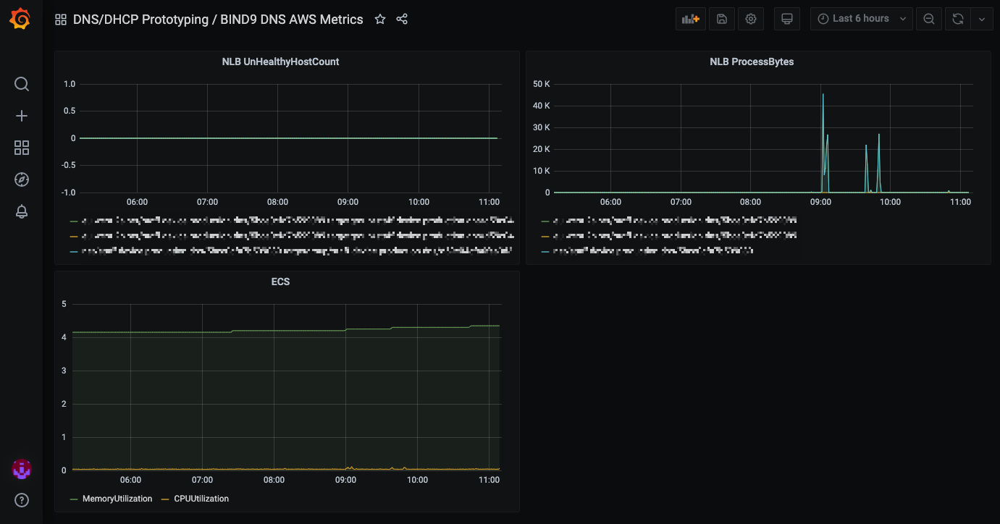

# Monitoring

Metrics are displayed in the [IMA Grafana dashboard](https://github.com/ministryofjustice/staff-infrastructure-monitoring).

The JSON that makes up the dashboard is stored in the [IAM dashboard configuration repo](https://github.com/ministryofjustice/staff-infrastructure-monitoring-config), when updates are made in the dashboard, the JSON needs to be saved and tracked with version control.

The metrics categories are:

- AWS Service metrics
- DNS metrics

