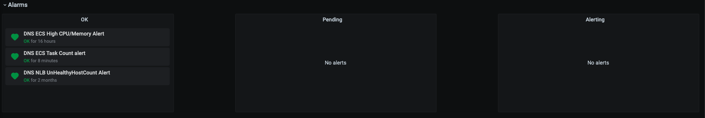
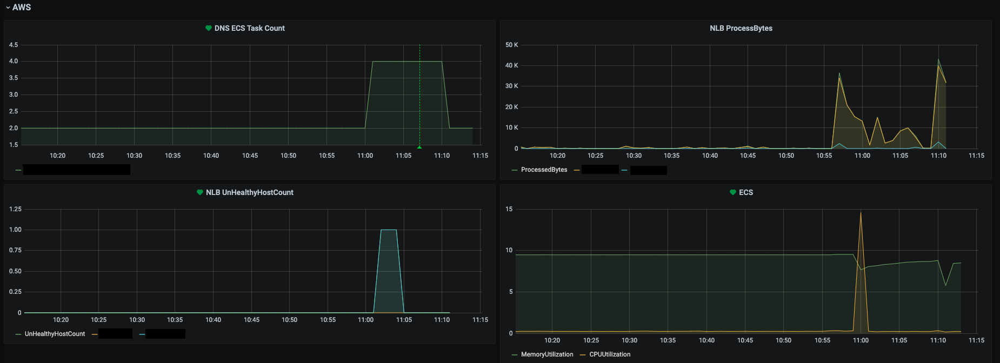
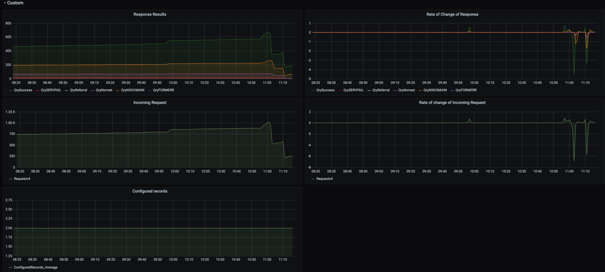

# Monitoring

DNS uses Grafana to display metrics. The Grafana dashboard can be found [here](https://monitoring-alerting.staff.service.justice.gov.uk/d/tm5gLH1Gz/bind-dns-metrics?orgId=1)

The JSON used to configure the dashboard is stored in the [IMA dashboard configuration repo](https://github.com/ministryofjustice/staff-infrastructure-monitoring-config). When updates are made in the dashboard, the JSON needs to be saved and tracked with version control. More information around this can be found in the documentation in IMA repo.

The DNS dashboard is separated into three sections:

- Alarms
- AWS Metics
- Custom DNS Metrics

## Alarms

The alarms section summarizes the state of the system and categorizes them as OK, Pending or Alerting.

- `OK` is a sign that the system is operating normally

- `Pending` indicates that the system may be either recovering or erroring

- `Alerting` shows that the system needs attention

## AWS Metrics

The AWS section displays all the relevant metrics to AWS. These include:

- [ECS Task Count](https://docs.aws.amazon.com/AmazonECS/latest/developerguide/cloudwatch-metrics.html)
- [NLB ProccessBytes](https://docs.aws.amazon.com/elasticloadbalancing/latest/network/load-balancer-cloudwatch-metrics.html)
- [UnHealthyHostCount](https://docs.aws.amazon.com/elasticloadbalancing/latest/classic/elb-cloudwatch-metrics.html)
- [ECS MemoryUtilization and CPUUtilization](https://docs.aws.amazon.com/AmazonECS/latest/developerguide/cloudwatch-metrics.html)

## Custom DNS Metrics

The Custom section displays all DNS metrics output by [BIND](https://bind9.readthedocs.io/en/latest/reference.html#bind-9-statistics)

The dashboards monitor the number of incoming requests, the number of configured records and a subset of [BIND 9 statistics counters](https://bind9.readthedocs.io/en/latest/reference.html#statistics-counters):

- QrySuccess (NOERROR)
- QrySERVFAIL
- QryReferral
- QryNxrrest
- QryNXDOMAIN
- QryFORMERR
