# BIND 9 Performance Testing

This documentation contains the results of the load test conducted on the 11th of January 2021. BIND 9 was the subject under test which is hosted on AWS infrastructure. The load testing tool that was used is [dnsperf](https://github.com/DNSPerf/dnsperf).

## Current Configuration

Configured as a Forwarding DNS Server forwarding to Protective DNS ([PDNS](https://ncsc.gov.uk/information/pdns))

## Considerations

- Tests are run from a remote site in Corsham, this may introduce network latency.

- The BIND configuration file is pulled from an S3 bucket.
BIND publishes custom metrics to CloudWatch every 10 seconds, resource usage for this is minimal and not visible in the metrics below.

## How to run the tests

- To run the tests below follow the [Corsham test guide](https://github.com/ministryofjustice/staff-device-dns-dhcp-infrastructure/blob/main/documentation/corsham-test.md) 

```shell
# -s DNS server address
# -d query file path
# -c number of clients
# -Q number of requests per second
# -t timeout (seconds)
# -l time limit in seconds
dnsperf -s dns \
        -d test_queryfile \
        -c 1 \
        -Q 10 \
        -t 2 \
        -l 300
```

- The ``test_queryfile`` has been sampled from a [test file](https://www.dns-oarc.net/files/dnsperf/data/queryfile-example-10million-201202.gz) containing 10 million records. The last 10K records were used.

- The ``-Q`` option limits the number of requests per second to a specific number, which is computed during the entire run of dnsperf.

## Load Test Results

The client and the request per second variables were incremented separately to isolate their effects on the performance. They were then increased simultaneously to send a larger load through the server.

## Test 1 (Queries = 1K, Clients = 1)

```shell
dnsperf -s dns \
        -d 1k_test_queryfile \
        -c 1 \
        -Q 1000 \
        -t 2 \
        -l 300
```

**Results (Queries = 1K, Clients = 1):**

```shell
Statistics:

  Queries sent:         300000
  Queries completed:    298991 (99.66%)
  Queries lost:         1009 (0.34%)

  Response codes:       NOERROR 210898 (70.54%), SERVFAIL 4394 (1.47%), NXDOMAIN 83699 (27.99%)
  Average packet size:  request 37, response 101
  Run time (s):         300.014971
  Queries per second:   996.586934

  Average Latency (s):  0.010422 (min 0.005613, max 1.986681)
  Latency StdDev (s):   0.051944
```

**AWS Metrics (Queries = 1K, Clients = 1):**

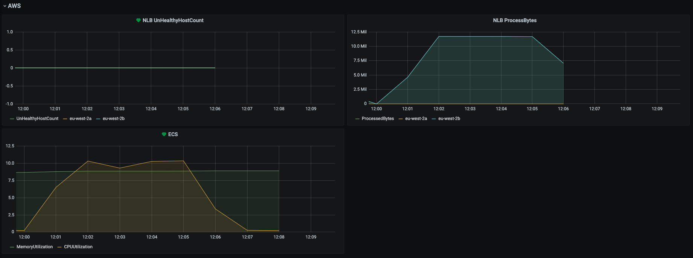

**Custom BIND Metrics (Queries = 1K, Clients = 1):**

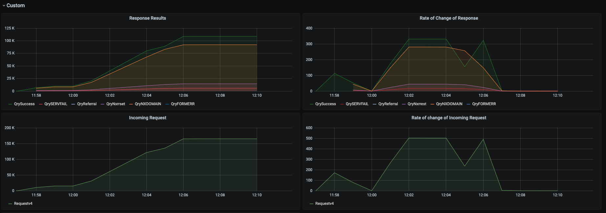

## Test 2 (Queries = 10K, Clients = 1)

```shell
dnsperf -s dns \
        -d 1k_test_queryfile \
        -c 1 \
        -Q 10000 \
        -t 2 \
        -l 300
```

**Results (Queries = 10K, Clients = 1)**

```shell
Statistics:

  Queries sent:         2093154
  Queries completed:    2085454 (99.63%)
  Queries lost:         7700 (0.37%)

  Response codes:       NOERROR 1471482 (70.56%), SERVFAIL 29988 (1.44%), NXDOMAIN 583984 (28.00%)
  Average packet size:  request 37, response 101
  Run time (s):         301.763520
  Queries per second:   6910.888367

  Average Latency (s):  0.006962 (min 0.004236, max 1.998273)
  Latency StdDev (s):   0.030665
```

**AWS Metrics (Queries = 10K, Clients = 1):**

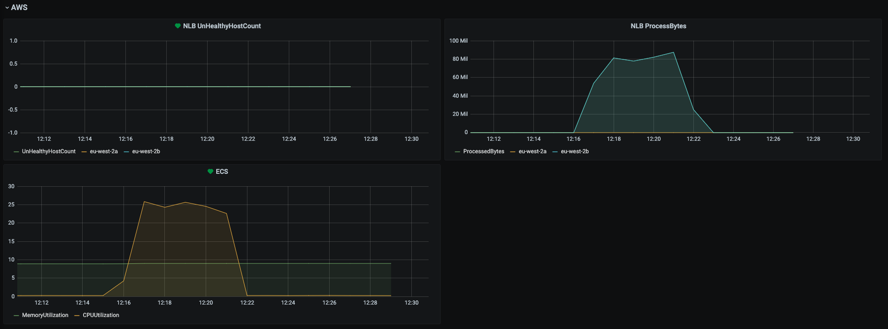

**Custom BIND Metrics (Queries = 10K, Clients = 1):**

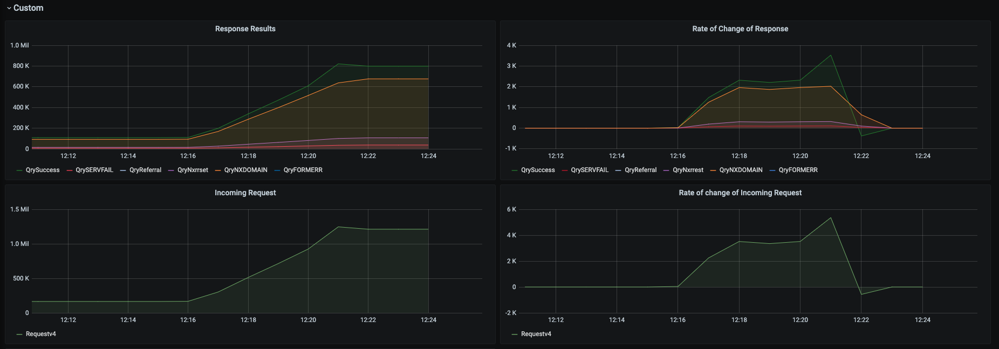

## Test 3 (Queries = 100K, Clients = 1)

```
dnsperf -s dns \
        -d 1k_test_queryfile \
        -c 1 \
        -Q 100000 \
        -t 2 \
        -l 300
```

**Results (Queries = 100K, Clients = 1)**

```
Statistics:

  Queries sent:         2138542
  Queries completed:    2131786 (99.68%)
  Queries lost:         6756 (0.32%)

  Response codes:       NOERROR 1503331 (70.52%), SERVFAIL 31814 (1.49%), NXDOMAIN 596641 (27.99%)
  Average packet size:  request 37, response 101
  Run time (s):         300.202776
  Queries per second:   7101.153522

  Average Latency (s):  0.007689 (min 0.002625, max 1.998770)
  Latency StdDev (s):   0.033808
```

**AWS Metrics (Queries = 100K, Clients = 1):**

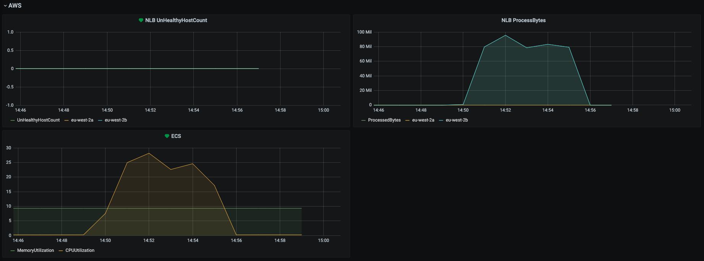

**Custom BIND Metrics (Queries = 100K, Clients = 1):**

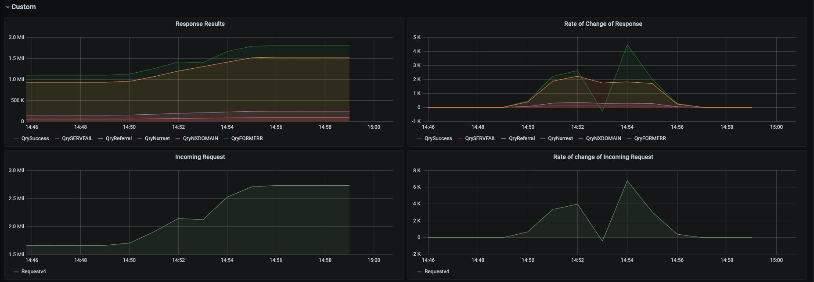


## Test 4 (Queries = 1K, Clients = 2)

```
dnsperf -s dns \
        -d 1k_test_queryfile \
        -c 2 \
        -Q 1000 \
        -t 2 \
        -l 300
```

**Results (Queries = 1K, Clients = 2)**

```
Statistics:

  Queries sent:         300000
  Queries completed:    299060 (99.69%)
  Queries lost:         940 (0.31%)

  Response codes:       NOERROR 210890 (70.52%), SERVFAIL 4475 (1.50%), NXDOMAIN 83695 (27.99%)
  Average packet size:  request 37, response 101
  Run time (s):         300.941649
  Queries per second:   993.747462

  Average Latency (s):  0.009875 (min 0.004681, max 1.974171)
  Latency StdDev (s):   0.052271
```

**AWS Metrics (Queries = 1K, Clients = 2):**

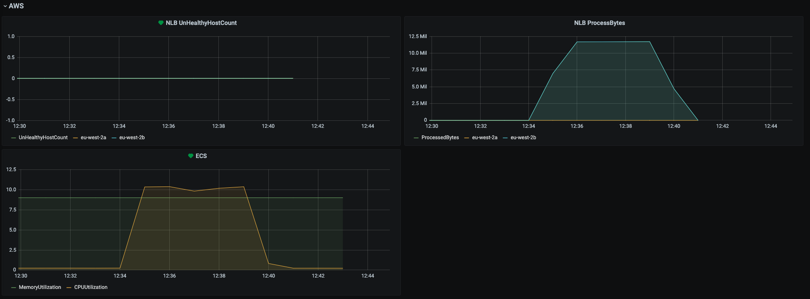

**Custom BIND Metrics (Queries = 1K, Clients = 2):**

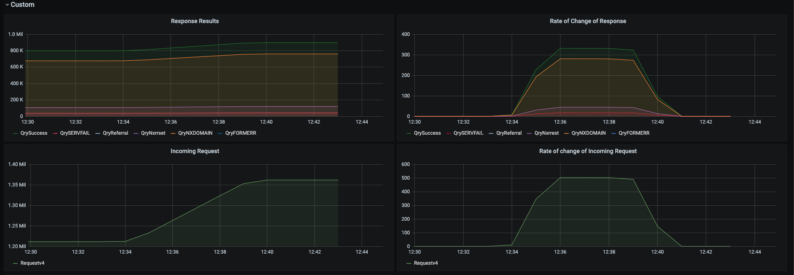

# Test 5 (Queries = 1K, Clients = 5)
```
dnsperf -s dns \
        -d 1k_test_queryfile \
        -c 5 \
        -Q 1000 \
        -t 2 \
        -l 300
```

**Results (Queries = 1K, Clients = 5)**

```
Statistics:

  Queries sent:         300000
  Queries completed:    299084 (99.69%)
  Queries lost:         916 (0.31%)

  Response codes:       NOERROR 210898 (70.51%), SERVFAIL 4486 (1.50%), NXDOMAIN 83700 (27.99%)
  Average packet size:  request 37, response 101
  Run time (s):         300.009098
  Queries per second:   996.916434

  Average Latency (s):  0.010197 (min 0.004673, max 1.982807)
  Latency StdDev (s):   0.054080
```

**AWS Metrics (Queries = 1K, Clients = 5):**

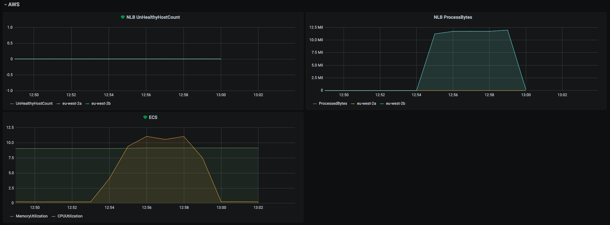

**Custom BIND Metrics (Queries = 1K Clients = 5):**

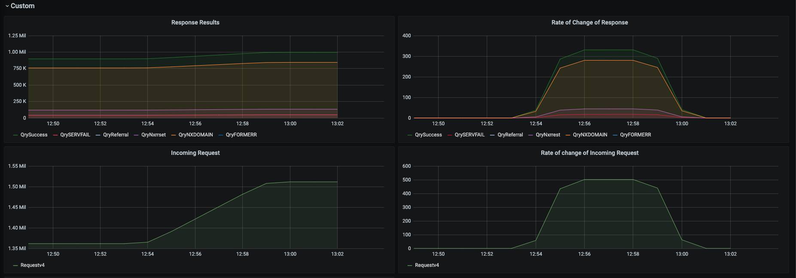

# Test 6 (Queries = 1K, Clients = 10)
```
dnsperf -s dns \
        -d 1k_test_queryfile \
        -c 10 \
        -Q 1000 \
        -t 2 \
        -l 300
```

**Results (Queries = 1K, Clients = 10)**
```
Statistics:

  Queries sent:         300000
  Queries completed:    299022 (99.67%)
  Queries lost:         978 (0.33%)

  Response codes:       NOERROR 210889 (70.53%), SERVFAIL 4438 (1.48%), NXDOMAIN 83695 (27.99%)
  Average packet size:  request 37, response 101
  Run time (s):         301.377897
  Queries per second:   992.182914

  Average Latency (s):  0.010574 (min 0.004689, max 1.999290)
  Latency StdDev (s):   0.055929
```

**AWS Metrics (Queries = 1K, Clients = 10):**


**Custom BIND Metrics (Queries = 1K, Clients = 2):**

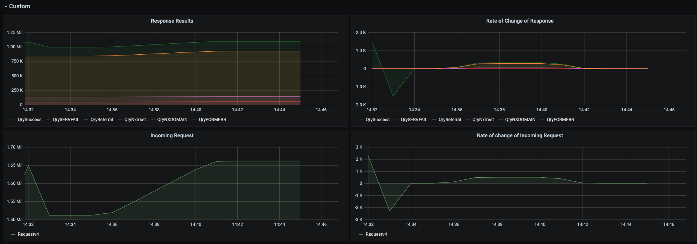

# Test 7 (Queries = 10K, Clients = 10)

```
dnsperf -s dns \
        -d 1k_test_queryfile \
        -c 10 \
        -Q 10000 \
        -t 2 \
        -l 300
```

**Results (Queries = 10K, Clients = 10)**

```
Statistics:

  Queries sent:         2130455
  Queries completed:    2124582 (99.72%)
  Queries lost:         5873 (0.28%)

  Response codes:       NOERROR 1497664 (70.49%), SERVFAIL 32519 (1.53%), NXDOMAIN 594399 (27.98%)
  Average packet size:  request 37, response 101
  Run time (s):         301.092793
  Queries per second:   7056.236647

  Average Latency (s):  0.008570 (min 0.004617, max 2.004626)
  Latency StdDev (s):   0.033006
```

**AWS Metrics (Queries = 10K, Clients = 10):**

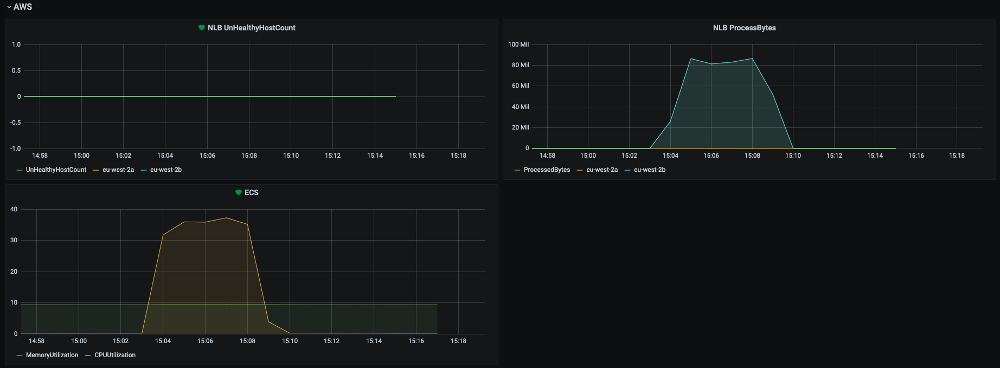

**Custom BIND Metrics (Queries = 10K, Clients = 10):**


## Test 8 (Queries = 100K, Clients = 100)

```
dnsperf -s dns \
        -d 1k_test_queryfile \
        -c 100 \
        -Q 100000 \
        -t 2 \
        -l 300
```

**Results (Queries = 100K, Clients = 100)**

```
Statistics:

  Queries sent:         2130326
  Queries completed:    2124498 (99.73%)
  Queries lost:         5828 (0.27%)

  Response codes:       NOERROR 1497562 (70.49%), SERVFAIL 32580 (1.53%), NXDOMAIN 594356 (27.98%)
  Average packet size:  request 37, response 101
  Run time (s):         301.444212
  Queries per second:   7047.731937

  Average Latency (s):  0.008386 (min 0.004533, max 1.998660)
  Latency StdDev (s):   0.034866
```

**AWS Metrics (Queries = 100K, Clients = 100):**

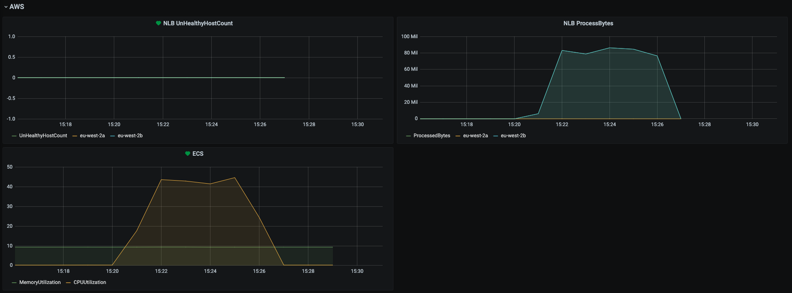

**Custom BIND Metrics (Queries = 10K, Clients = 10):**

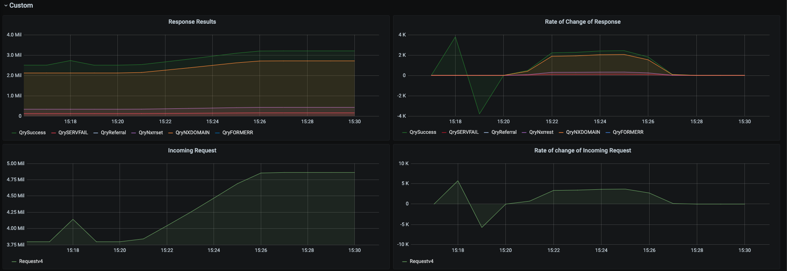


## Test 9 (Queries = 1 Million, Clients = 1K)

```
dnsperf -s dns \
        -d 1k_test_queryfile \
        -c 1000 \
        -Q 1000000 \
        -t 2 \
        -l 300
```

**Results (Queries = 1 Million, Clients = 1K)**

```
Statistics:

  Queries sent:         2146678
  Queries completed:    2141082 (99.74%)
  Queries lost:         5596 (0.26%)

  Response codes:       NOERROR 1509053 (70.48%), SERVFAIL 33119 (1.55%), NXDOMAIN 598910 (27.97%)
  Average packet size:  request 37, response 101
  Run time (s):         301.082723
  Queries per second:   7111.274864

  Average Latency (s):  0.008517 (min 0.004543, max 1.998600)
  Latency StdDev (s):   0.035495
```

**AWS Metrics (Queries = 1 Million, Clients = 1K):**

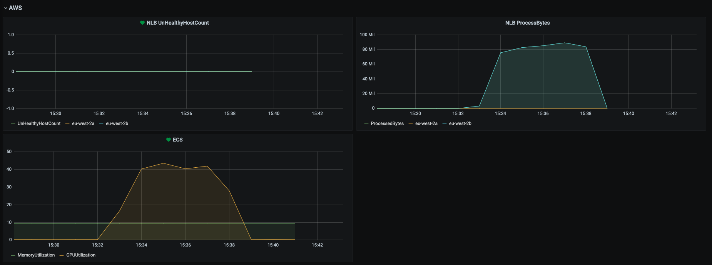

**Custom BIND Metrics (Queries = 1 Million, Clients = 1K):**

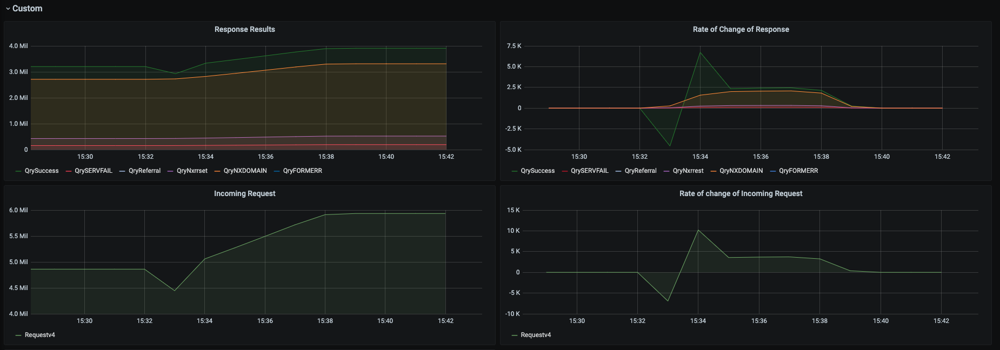

## Conclusion

With the largest parameter set of one million queries and one thousand clients, the system achieved 2,146,678 queries with a ECS CPU Utilization of approximately 45%.

Based on these results, the system (as configured) has spare capacity to cater for larger demand spikes.
